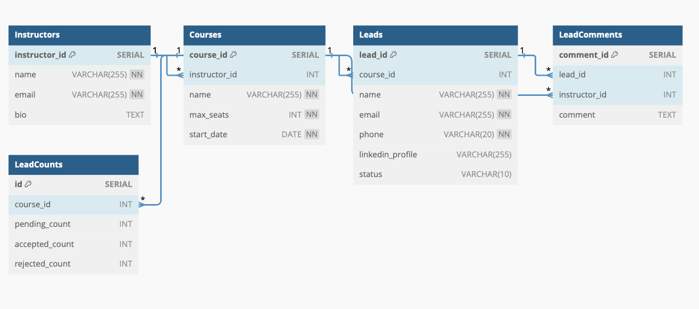

# Airtribe Backend API

The backend API for Airtribe, an application for managing online courses. The API is built using Node.js , Express js and PostgreSQL, and it provides endpoints for managing courses, instructors, leads, and more.

## Postman Documentation

Explore the API endpoints and test them using Postman. Access the documentation [here](https://documenter.getpostman.com/view/25809155/2sA2xfZZKZ).

You can direclty fork the collection from the link and start using the API In postman app or directly from the browser.

No need to enter the endpoints manually and test them.

You can also find the Documentation of each api with the request , response , schema of the response ,example of the response and you can also test the api from the documentation itself.

## Database Schema



## Getting Started

To set up the development environment and run the API locally, follow these steps:

### Prerequisites

- Node.js 
- Docker 

### Installation

1. Clone the repository:

    ```bash
    git clone https://github.com/p-1000/airtribe-assignment.git
    ```

2. Navigate to the project directory:

    ```bash
    cd airtribe
    ```

### Building Docker Image

Build the Docker image for the application:

```bash
docker build -t app-airtribe .
```

### Running Docker Containers

1. Start the Docker containers using Docker Compose:

    ```bash
    docker-compose up -d
    ```

2. Once the containers are running, execute the following command to create the database tables:

    ```bash
    curl -X POST http://localhost:13000/createTables
    ```

### Environment Variables

already set in the docker-compose.yml file and the .env file so no need to set them manually.

### Accessing the API

The API will be accessible at `http://localhost:13000`.

For a complete list of endpoints and their usage, visit the documentation endpoint mentioned in the Postman documentation section. [click here for api docs and testing](https://documenter.getpostman.com/view/25809155/2sA2xfZZKZ).